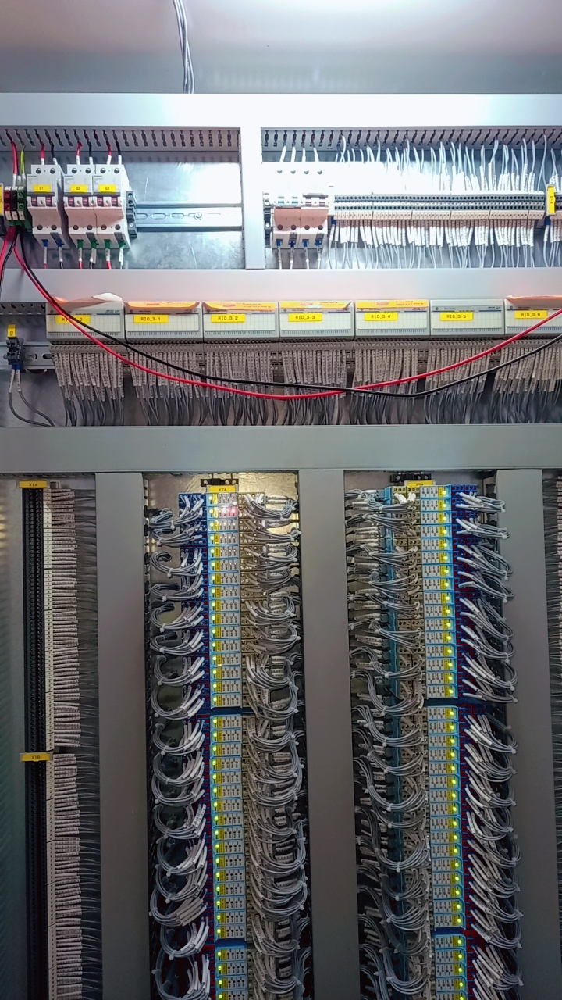

PLC Panels work by receiving input signals from various sensors and devices, processing the data using programmed logic, and generating output signals to control machinery and processes. They act as the brain of automation systems, enabling real-time monitoring, precise control, and seamless coordination of industrial operations. Harness the power of PLC Panels to streamline your automation processes and boost productivity.

   
  
  
  
  
  

<i>Hands-on PLC Panel Wiring And Industrial Compomonet Assembly (Omkar creations Internship)</i>

